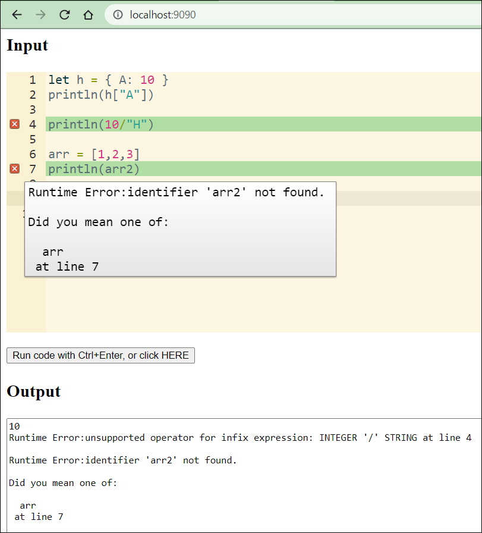

## Run magpie programs in the browser using WebAssembly

In the magpie home directory, just run `run_wasm.sh`, then
open your browser, and type `http://localhost:9090`.

Below is the snapshot of the running magpie demo in browser:

